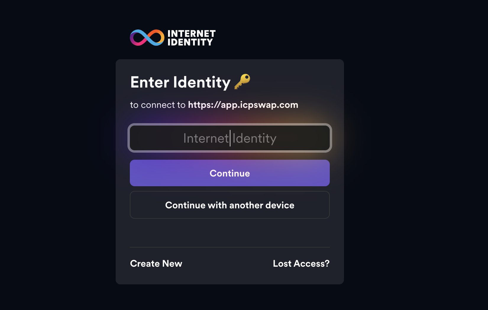

# 🟧 BLend: BTC Lending Protocol on ICP

## I. Overview

### 📌 Protocol Introduction

As native Bitcoin DeFi continues to evolve, more and more outstanding projects are exploring how to unlock BTC's on-chain liquidity. However, we have observed that:

> Despite the rapid development of this sector, there is still a **lack of a mature, native, and highly optimized BTC lending protocol** within the **ICP ecosystem**.

**BLend** was created to fill this gap — aiming to become a truly BTC-focused, decentralized financial infrastructure built natively on ICP.

---

### 💡 Name Meaning: What does “BLend” stand for?

The name *BLend* embodies the core philosophy behind our protocol:

- **B** → Bitcoin, the foundational value anchor of crypto finance  
- **Lend** → Lending, one of the most fundamental and widely adopted primitives in DeFi  
- **Blend** → Fusion, reconstruction, and reinvention — symbolizing our reimagination of BTC utility

With this name, we aim to express our commitment to Bitcoin:  
Not just as a store of value, but as **a productive capital** in the world of DeFi.

### 🧩 Our Core Vision: What Are We Building?

By deeply blending **“B” (Bitcoin)** and **“Lend” (Lending)**, **BLend** aims to create a:

- **Bitcoin-centric** protocol  
- With **efficient lending capabilities**  
- That enables **cross-chain liquidity**  
- And is **trustless, verifiable, and composable**

A truly native **decentralized financial infrastructure** — serving BTC users and developers, and driving the growth of Bitcoin DeFi on ICP.

---

## II. Core Operation Mechanism

### 🏦 Borrowing: When You Need Extra Firepower

At **BLend**, the interest you pay when borrowing is determined by a **Dynamic Interest Rate Model based on Utilization Rate** — fancy words for a system that adapts as more people borrow.

#### 📐 Utilization Rate: How "Busy" is the Pool?

Utilization rate tells us what percentage of the liquidity in the pool has already been borrowed.

 

$$
U = \frac{Total\ Borrowed\ Assets}{Total\ Liquidity\ (Borrowed + Available)}
$$

 

**Example:**  
If the pool has a total of 100 BTC and 60 BTC have been borrowed, then the utilization rate $U = 60\%$.

 

| Parameter                 | Value   |
|--------------------------|---------|
| Base Rate                | 1.2%    |
| Utilization Optimal Rate | 70%     |
| Slope 1                  | 2%      |
| Slope 2                  | 40%     |

&nbsp;

Now here's how we calculate your borrow rate, depending on how busy the pool is:

#### 🧮 If $U \leq U_{optimal}$ (i.e., the pool still has breathing room):

> You're borrowing at a relatively peaceful time.

$$
BorrowRate = BaseRate + \left( \frac{U}{U_{optimal}} \right) \times Slope1
$$

#### 🚨 If $U > U_{optimal}$ (i.e., everyone's grabbing money):

> You're borrowing during rush hour, and it's gonna cost a bit more.

$$
BorrowRate = BaseRate + Slope1 + \left( \frac{U - U_{optimal}}{1 - U_{optimal}} \right) \times Slope2
$$

&nbsp;

This system ensures fair pricing:  
- **Low usage = low rates = good time to borrow**  
- **High usage = higher rates = maybe wait or pay up**

---
### 💰 Supply Rate

When a user supplies assets into BLend, **10% of the deposited amount** is automatically allocated to the **Reserve Pool** — a buffer designed to absorb risk for the protocol.  

But don’t worry — **that portion still belongs to you**, and you’ll get it back when you **fully withdraw** your liquidity.

Meanwhile, your **supply rate (interest earnings)** comes from the interest paid by borrowers.  
After the protocol takes a small fee, the **remaining interest is proportionally distributed** to all liquidity providers based on their share in the pool.

---

### 💸 Deposit Allocation Logic

Let’s say you deposit a total of:

&nbsp;

$$
Deposit_{user} = X
$$

Here’s how your funds are split:

- **10%** → Platform reserve (risk buffer)  
- **5%** → Still counted as yours, just kept in reserve  
- **85%** → Actively enters the pool to earn interest  

So we calculate:

&nbsp;

$$
ReserveShare_{user} = 0.15 \times X
$$

$$
ActiveLiquidity_{user} = 0.85 \times X
$$

When you decide to withdraw, you’ll get back:

&nbsp;

$$
Withdraw_{user} = ReserveShare_{user} + ActiveLiquidity_{user} + AccruedInterest_{user}
$$

---

### 📈 Annualized Yield per User

Each user *i* earns annually:

&nbsp;

$$
UserEarnings_i = TotalInterest_{year} \times (1 - ReserveFactor)
$$

That’s it — your deposit works while you chill 😎

---

### 🔁 Repay (Paying Back Your Loan)

"Repay" means returning the BTC (or any other borrowed asset) back to the lending pool — settling both the **principal + interest**, unlocking your collateral, and restoring your borrowing capacity.

At **BLend**, we believe **debt should be transparent**, not buried in confusing APR/APY jargon.

---

### 👤 User Perspective

1. You initiate repayment — **you’ll only see ONE number** (principal + interest).
2. The system **first deducts accrued interest** (`Accrued Interest`).
3. Remaining amount goes toward **paying off the principal** (`Borrowed Principal`).
4. Your **borrow balance and Health Factor** are updated.
5. If fully repaid, your **collateral is unlocked and withdrawable**.

---

### 🛠 Under the Hood (Tech Flow)

1. Check that repayment amount > 0.
2. Validate the asset exists in a supported lending pool.
3. Fetch the **maximum repayable amount** for the user.
4. Confirm the user actually has outstanding debt (> 0).
5. Ensure repayment amount ≤ outstanding loan.
6. Transfer funds into the **corresponding lending pool**.
7. Update the user's `borrowed` state.

---

### 💰 Withdraw (Getting Your Assets Back)

"Withdraw" means taking out your supplied BTC (or other assets), along with the **interest you've earned** — either partially or in full.

---

### 👤 User Flow

1. User initiates a `Withdraw` action — partial or full.
2. Protocol calculates how much you can withdraw:
   - Your **original deposit**
   - Your **accrued interest** (`Accrued Interest`)
3. If pool has enough liquidity → **instant payout** 🟢
4. If your request exceeds available funds → system enables **Slow Withdraw Mode™** 🐢 (more on that later)
5. Once processed, your **supply status is updated** accordingly.

---

> ⛽️ TL;DR: Repay clears your debt, Withdraw reclaims your assets. BLend ensures both are smooth, transparent, and user-first.

### 💥 Liquidation Mechanism

When a borrower’s collateral value drops — or the borrowed amount becomes too large — the system must step in to **partially or fully close the borrower’s position** to prevent losses.  
This process is called **Liquidation**.

#### 🎯 Purpose of Liquidation

- ⛔ Prevent bad debt from hurting the protocol  
- 🧮 Recover the debt by auctioning or discount-selling collateral  
- 🔐 Ensure overall system health and protect depositors’ funds  

> 💡 Liquidation is a **core risk management mechanism** in any DeFi lending protocol.

---

| Parameter                  | Description                                           | ICP   | BTC/ETH | USDC  |
|---------------------------|-------------------------------------------------------|-------|---------|--------|
| **Collateral Factor**     | Portion of collateral value allowed to be borrowed    | 0.75  | 0.70    | 0.80   |
| **Liquidation Threshold** | Max borrowing ratio before triggering liquidation     | 0.80  | 0.75    | 0.85   |
| **Liquidation Bonus**     | Discount (bonus) granted to the liquidator            | 0.05  | 0.05    | 0.05   |

### 🧪 Health Factor (HF)

The **Health Factor (HF)** is like your wallet’s cholesterol level —  
a quick check to see if your position is healthy or on the verge of collapse 🫣.

It's calculated as:

$$
HF = \frac{\text{Collateral Value} \times \text{Liquidation Threshold}}{\text{Borrowed Amount} + \text{Accrued Interest}}
$$

- If **HF ≥ 1**: You're good! Your account is healthy and safe 🟢  
- If **HF < 1**: Danger zone! You’re undercollateralized and eligible for liquidation 🔥

---

### 📊 Health Factor with Multiple Collateral Assets

Most users don’t just deposit one coin, so let’s talk multi-asset portfolios.

When you deposit multiple types of collateral (e.g., ICP, BTC, ETH),  
your **overall Health Factor** is calculated like this:

$$
HF = \frac{
\sum_i (\text{Collateral}_i \times \text{Price}_i \times \text{LiquidationThreshold}_i)
}{
\sum_j (\text{Debt}_j + \text{AccruedInterest}_j)
}
$$

In plain English:

- **Numerator** = Your total collateral value, *adjusted for each asset’s liquidation threshold*  
- **Denominator** = Everything you owe: principal + all accumulated interest  

> The higher your HF, the safer your position. Think of it as your DeFi "credit score" — and yes, we’re watching it in real time 👀.

## 🔥 Liquidation Flow (Simplified Version)

1. Anyone spots an account with a **Health Factor (HF) < 1** — Uh-oh!
2. The liquidation process kicks in, allowing **liquidators** to repay the borrower’s debt.
3. In return, liquidators get the borrower’s collateral at a **discounted price**.
4. The borrower's account is fully liquidated, and the HF bounces back to a safe level.

> ⚠️ For now, we only support **full liquidation** — liquidators must repay the entire debt at once.  
> Future versions will allow **partial liquidation**. If HF remains unsafe after liquidation, the system will continue zapping the account until it’s either empty or healthy.

---

### 👤 Borrower's POV: “Wait, what just happened?”

- You borrowed some assets. The system tracks your **Health Factor** in real time.
- Then BTC price drops. Uh-oh — your collateral value just shrank.
- Once HF < 1, the protocol **sells your collateral to a liquidator** (at a discount).
- You lose part of your collateral and pay the price — literally — via liquidation penalties.
- ✅ Pro tip: Top up or repay when HF gets close to 1 to avoid the axe.

---

### 🦾 Liquidator's POV: “How do I make money here?”

- Liquidators repay a portion (or all) of someone else's bad debt.
- In return, they get **collateral at a discount (5%–10%)** — sweet deal.
- Example:
  - You repay debt worth 1 BTC.
  - The system gives you 1.1 BTC worth of collateral.
  - 💰 You pocket 0.1 BTC profit — not bad for some DeFi hustle!

> 📌 Different assets have different liquidation bonuses.  
> For maximum incentive, **BTC gives the highest reward: 10%** — because it’s king 👑.

## II. 🧭 User Guide

### 🚀 Getting Started

Internet Identity Login Interface

First, create your own **Internet Identity** — your key to accessing everything in BLend.  
Once that’s done, you’re ready to dive in and start exploring!

---

### ⚙️ Core Operations

#### 💰 Supplying / Depositing Assets

- Head over to the **“Earnings”** page. You’ll see 4 vault options — choose one and enter the amount you want to deposit, then click **“Deposit”**.
- Once deposited, your assets will **start earning interest automatically** — no manual actions needed!
- You can track your **principal + accumulated interest** at any time in the **Personal Center**. Interest is calculated daily and reflected together with your balance.
- When you’re ready to withdraw, you can **withdraw both principal and interest anytime**.  
  For large amounts, the system will automatically trigger a **gradual withdrawal mechanism**, spreading your funds over multiple transactions to protect pool stability.

#### 🏦 Borrowing Assets

- Click **“Connect”** to authenticate your identity and access the system.
- Go to the **“Borrow”** page, choose the collateral you want to lock up (ICP, BTC, ETH, or USDC), enter the amount, and hit **“Submit”**.
- Based on your collateral, the system will show you the **maximum borrowable amount**. Choose how much you want to borrow and click **“Confirm Borrow”**.
- On the **Personal Center** page, you can keep track of all the important stuff:
  - Total debt (including interest)
  - Your **Health Factor** (aka how close you are to getting liquidated 😬)
  - Accrued interest (updated daily — yay, compound interest!)

- You can **repay at any time**, either partially or in full. Once you clear your debt, your collateral is **automatically unlocked and ready for withdrawal**. 🎉

---

## III. 🧠 Protocol Mechanics (For Developers / Power Users)

### 🛠 Supply Logic (Developer View)

When a user supplies assets to the protocol, the following steps are executed under the hood:

1. **Validate input amount**  
   Ensure `NumTokens > 0` — zero is not a valid deposit.

2. **Verify pool existence**  
   Confirm that a pool corresponding to the specified `token_id` exists.

3. **Check pool capacity**  
   Ensure that the pool has enough room:  
   `(Max Pool Capacity - Current Pool Balance) ≥ NumTokens`.

4. **Update pool balance**  
   Add the supplied tokens to the pool.

5. **Record user deposit**  
   Update the user's supply record and the pool’s token capacity accordingly.

### 🛠 Borrow Logic

When a user tries to borrow some tokens, we don’t just throw the money at them — here’s what actually happens:

1. **Check if the user wants *more than zero***  
   Because borrowing 0 tokens is just... philosophical. We need `NumTokens > 0`.

2. **Validate the token pool exists**  
   Ensure there's a lending pool for the given `token_id`. If not, no tokens for you.

3. **Check if the user has legit collateral**  
   User must have deposited accepted assets (like ICP, BTC, ETH, USDC). No imaginary coins allowed.

4. **Calculate max borrowable amount**  
   Based on deposited collateral, price feeds, liquidation thresholds, and protocol parameters, we compute how much the user *can* borrow — safely.

5. **Ensure the user isn’t trying to YOLO too much**  
   The requested `NumTokens` must be ≤ `MaxBorrowableAmount`. Over-borrowing gets rejected.

6. **Transfer funds from the pool**  
   If the pool has enough liquidity, we send the tokens to the user. It's like a payday, except you owe us.

7. **Update the borrow record**  
   We update the user's borrow balance, interest tracking, and health factor. Basically: “Congrats, you're now officially in debt.”

### 🔁 Repay Logic 

When a user wants to repay their loan — great! But we still need to verify they’re not just clicking buttons for fun.

Here’s what happens under the hood:

1. **Check if the user actually typed a number > 0**  
   `NumTokens > 0` — we don’t process fake generosity.

2. **Confirm there's a valid lending pool for the given token**  
   If this token isn't borrowable, repayment is meaningless.

3. **Verify the user really has a loan to repay**  
   No borrow history? No repayment needed. Don’t pretend to be responsible.

4. **Calculate the max repayable amount**  
   This includes all unpaid principal and accrued interest. Know your total tab.

5. **Ensure the user isn’t trying to over-repay**  
   `NumTokens` must be less than or equal to what they actually owe. No donations accepted.

6. **Send the repayment back to the pool**  
   We split it into interest and principal. The pool says: “Thanks for the tip.”

7. **Update borrow rate if utilization has changed**  
   Since repayment affects utilization, we recalculate the interest rate accordingly.

8. **Update the user’s borrow record**  
   New debt balance, reduced interest accumulation, and a better health factor. You're less likely to be liquidated — yay!

### 🏧 Withdraw

1. **Check the amount**: Make sure `Numtokens > 0`. No ghost withdrawals allowed.
2. **Validate the pool**: Ensure there's a pool that supports the given token ID.
3. **Verify ownership**: Confirm that the user actually has a deposit in this pool.
4. **Calculate max withdrawable amount**: Based on user's supply minus any borrowed amounts.
5. **Validate input**: Make sure `Numtokens <= max withdrawable amount`. No magic tricks.
6. **Check liquidity**: Ensure the pool has enough unborrowed tokens to meet the request.
7. **Transfer funds**: Send the appropriate amount from the pool back to the user.
8. **Update records**: Adjust the user's supply balance and pool's total state.

### 💥 Liquidate (Liquidation Mechanism)

When a borrower's health factor falls below the protocol-defined threshold, third-party liquidators are allowed to repay the borrower's debt and acquire a portion of their collateral. The following outlines the standardized liquidation flow:

1. **Verify Borrower Existence**  
   Ensure the target address is a valid user and has outstanding debt recorded in the system.

2. **Calculate Health Factor**  
   Evaluate the borrower's account by computing the Health Factor using the formula:  
   *(Collateral Value × Liquidation Threshold) / (Borrowed Amount + Accrued Interest)*.  
   If **Health Factor < 1**, liquidation is permitted.

3. **Determine Liquidation Payment Amount**  
   Calculate the total repayment amount required from the liquidator to cover the borrower's current debt. This typically includes both principal and accrued interest.

4. **Calculate Maximum Collateral Transferable to Liquidator**  
   Based on the protocol's liquidation bonus rate, determine the maximum value of collateral that can be seized by the liquidator at a discounted rate.

5. **Execute Liquidation**  
   The liquidator repays part or all of the borrower's outstanding debt. In return, the corresponding portion of collateral is transferred to the liquidator, according to the protocol-defined rules.

6. **Update System States**  
   The system updates the borrower's `borrow` and `supply` balances, and reflects changes in the pool’s available liquidity and total reserves.

