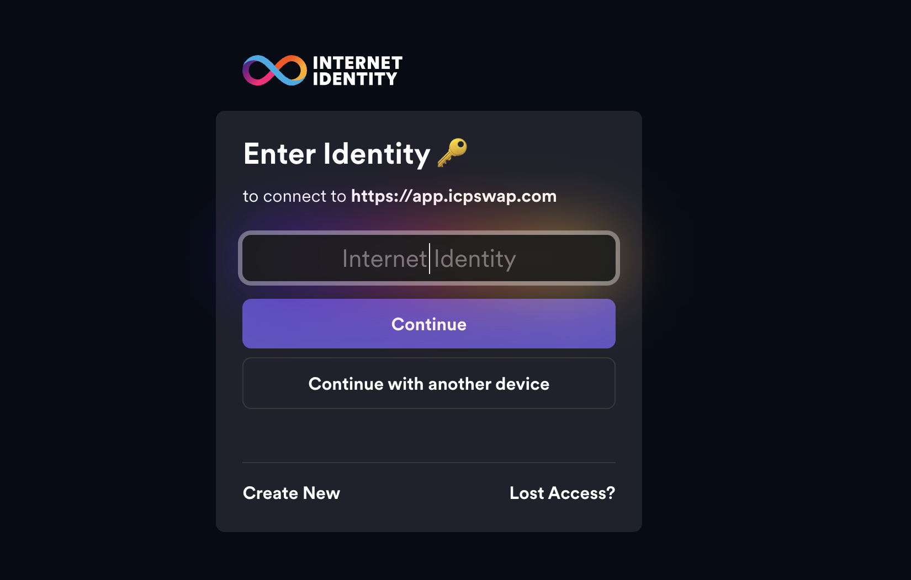

<<<<<<< HEAD
# ⚡️BLend — 让你的比特币真正“动”起来

> 别再让你的 BTC 安静躺着吃灰了。

**BLend** 是个部署在 Internet Computer（ICP）上的真正去中心化比特币借贷协议。

不包裹资产、不跨链桥接、不妥协安全。

- 🚀 用 BTC、ETH 或稳定币赚利息  
- 🔐 以 BTC 抵押借出资金，风险可控  
- 💥 清算不良债务，获取协议奖励  
- 🧠 一键登录（支持 Internet Identity），再也不用记助记词

### 为什么选择 BLend？

因为你的比特币值得更高效的利用。  
BLend 让它全天候、安全、原生地为你“打工”。

> **ETH 可以质押，Meme 可以耕种，是时候让 BTC 也开始挣钱了。**


## 项目目录

👩🏻‍🔬 [技术文档（英文）](https://github.com/guoying2026/IC-Vibe-Coding-Template-Rust/tree/main)

📚 [EN 详细的协议介绍 xD](https://github.com/guoying2026/IC-Vibe-Coding-Template-Rust/blob/main/Docs_EN.md)

📖 [CN 详细文档](https://github.com/guoying2026/IC-Vibe-Coding-Template-Rust/blob/main/Docs_CN.md)

📚 [EN Mechanism Docs ](https://github.com/guoying2026/IC-Vibe-Coding-Template-Rust/blob/main/Docs_CN.md)

📖 [CN 技术文档 ](https://github.com/guoying2026/IC-Vibe-Coding-Template-Rust/blob/main/Docs_CN.md)

📚 [EN User Guide ](https://github.com/guoying2026/IC-Vibe-Coding-Template-Rust/blob/main/Docs_CN.md)

📖 [CN 用户指南 ](https://github.com/guoying2026/IC-Vibe-Coding-Template-Rust/blob/main/Docs_CN.md)

以及以下这里就是超技术的Readme文档
=======
# 🟧 BLend: BTC 借贷协议 on ICP

## I. 概述 (Overview)

### 📌 协议介绍 (Introduction)

在当前比特币原生 DeFi 不断发展的背景下，越来越多优秀项目正在探索如何激活 BTC 的链上流动性。然而，我们注意到：

> 尽管赛道正在快速推进，在 **ICP 生态** 中，仍缺乏一个**成熟、原生、且高度优化的 BTC 借贷协议**。

**BLend** 的出现，正是为了填补这一空白，打造一个真正服务于 BTC 用户的原生去中心化金融基础设施。

---
>>>>>>> 797f8024974ba2de448156a77b903a34396fcfa9

### 💡 协议命名释义（What does “BLend” mean?）

BLend 的命名，深刻诠释了我们协议的核心理念：

- **B** → Bitcoin，加密金融的价值锚定
- **Lend** → 借贷行为，DeFi 中最基础且最广泛应用的金融工具
- **Blend** → 融合、重构与再创造，象征我们对 BTC 使用方式的重新定义

我们希望借由这个名字，传达出我们对 BTC 的承诺：  
不仅仅是储值资产，更是 DeFi 世界的高效资本。

---

### 🧩 核心愿景（What We Aim to Build）

通过将 **“B” 与 “Lend”** 深度融合，**BLend** 致力于构建一个：

- 以 **比特币为核心**
- 具备 **高效借贷能力**
- 支持 **跨链流动性**
- 拥有 **去信任化、可验证、可组合性**

的原生 **去中心化金融协议**，服务 BTC 用户与开发者，推动 ICP 生态的比特币金融基础设施建设。

---

## II. 核心操作机制（Core Operation Mechanism）

### 🏦 借款 Borrow

**BLend 的借款利率采用基于利用率的动态利率模型（Dynamic Interest Rate Model based on Utilization Rate）**，以此在供需变化中平衡借贷双方的激励。

#### 📐 利用率（Utilization Rate）

利用率衡量当前池子中有多少比例的流动性资产已被借出：

&nbsp;

$$
U = \frac{已被借出的资产数量}{池子中资产总量（借出 + 可用）}
$$

&nbsp;

举个例子：假设池子里总共有100个BTC，其中有60个BTC被借出去了，那么U=60%。

&nbsp;

<div align="center">

| 参数                     | 参数值 |
| ------------------------ | ------ |
| Base Rate                | 1.2%   |
| Utilisation Optimal Rate | 70%    |
| Slope 1                  | 2%     |
| Slope 2                  | 40%    |

</div>

&nbsp;

当 $U \leq U_{optimal}$ 时：

$$
BorrowRate = BaseRate + \left( \frac{U}{U_{optimal}} \right) \times Slope1
$$

当 $U > U_{optimal}$ 时：

$$
BorrowRate = BaseRate + Slope1 + \left( \frac{U - U_{optimal}}{1 - U_{optimal}} \right) \times Slope2
$$

&nbsp;

### 💰 Supply Rate

每位用户在提供流动性时，系统会自动将其存入金额的**10%**划入协议的**储备池（Reserve Factor**，作为池子的风险缓冲资金。

但这部分资金仍归属于用户本人，可随时提取，并会在用户选择**全部退出流动性时一并返还**。

此外，**存款利率（Supply Rate）** 由借款人支付的利息决定。 平台在收取少量手续费后，**将剩余收益按比例分配给所有存款人**，所有流动性提供者将根据其在池子中的占比，获得**公平的收益分配**。

### 💸 存款资金划分逻辑（Deposit Allocation）

假设用户存入总金额为：

$$
Deposit_{user} = X
$$

其中：

- **15%** 被划入储备池（10%为平台费用+5%仍为用户所有）
- **85%** 进入可参与收益分配的主池

则有：

$$
ReserveShare_user = 0.15× X
$$

$$
ActiveLiquidity_user = 0.85 × X
$$

当用户退出时，两部分都会返还：

$$
Withdraw_user = ReserveShare_user + ActiveLiquidity_user + AccruedInterest_user
$$

每个用户 i 的年化收益为：

$$
UserEarningsi​=(Total Interest per year​×(1−ReserveFactor))
$$

### 🔁 Repay（还款）

Repay 是指借款人偿还所借的 BTC（或其他资产）到借贷池中，归还本金与利息，解除抵押，恢复借款额度。

在 **BLend 协议**中，我们致力于让用户清楚感知借款成本，不再将「债务」隐藏在复杂的 APR/APY 或技术术语背后。

### 👤 用户视角

1. 用户发起还款，**看到的总金额只有一个**（利息 + 本金）
2. 系统优先扣除累计应付利息（`Accrued Interest`）
3. 剩余部分用于归还本金（`Borrowed Principal`）
4. 更新用户借款余额与健康因子
5. 若还清全部债务，**释放抵押资产锁定**

### 🛠 技术层面

1. 验证用户输入的还款金额大于 0
2. 检查所还资产是否对应可支持的借贷池
3. 获取用户所需归还的最大金额
4. 确保用户已有借款（借出金额大于 0）
5. 核实用户还款金额 ≤ 当前借款金额
6. 将还款资产转入对应的借贷池
7. 更新用户的借款余额数据

### 💰 Withdraw（提现）

Withdraw 是指用户在提供流动性后，选择部分或全部取出其存入的 BTC（或其他资产）及所累积的收益。

### 👤 用户视角操作流程

1. 用户发起 `Withdraw` 操作（可选择部分或全部）
2. 协议计算当前可提取的资产数量，包括：
   - 初始存入本金
   - 所赚取的利息（`Accrued Interest`）
3. 若池子流动性充足，资产即时返还用户
4. 若提现金额超出池中可用余额，则按“缓取机制”处理（详见下文）
5. 提现成功后，用户的 supply 状态同步更新

### 💥 清算机制（Liquidation Mechanism）

当借款人的资产价值下跌，或借款金额过高，导致抵押品不足以覆盖债务时，系统必须及时介入，将其头寸部分或全部关闭，以防止协议亏损。这就是**清算（Liquidation）**。

清算机制的主要目的：

- ⛔ 避免协议因坏账而蒙受损失
- 🧮 通过拍卖或折价出售抵押品，回收债务
- 🔐 保证系统整体健康度与存款人资金安全

> 💡 清算是 DeFi 协议中核心的风险管理模块。

| 参数                              | 含义                                   | ICP  | BTC/ETH | USDC |
| --------------------------------- | -------------------------------------- | ---- | ------- | ---- |
| 抵押系数                          | 借款人所抵押的总数中可以被借出来的比例 | 0.75 | 0.7     | 0.8  |
| 清算门槛（Liquidation Threshold） | 抵押资产可用的最大借贷比例             | 0.80 | 0.75    | 0.85 |
| 清算惩罚（Liquidation Bonus）     | 清算人获得的奖励折扣                   | 0.05 | 0.05    | 0.05 |

### 健康因子（Health Factor, HF）

我们使用健康因子（Health Factor, HF）来衡量账户安全性：

$$
Health Factor = （抵押资产价值 × 清算门槛） / （借出总额 + 累积利息）
$$

- 若 **HF ≥ 1**：账户健康，安全运行
- 若 **HF < 1**：账户不健康，进入清算流程

### 多资产健康因子计算（Health Factor with Multiple Assets）

我们使用以下公式来计算包含多个资产的健康因子（Health Factor, HF）：

$$
HF = \frac{
\sum_i (\text{抵押资产}_i \times \text{当前价格}_i \times \text{清算门槛}_i)
}{
\sum_j (\text{借出资产}_j + \text{对应的累积利息}_j)
}
$$

#### 也就是说：

- **分子**：你提供的**所有抵押资产加权总价值**（考虑清算门槛）
- **分母**：你借出的**所有资产本金 + 各自的利息**

## 清算流程（简化版）

1. 任何人发现某账户的健康因子（Health Factor, HF）低于 1。
2. 启动清算逻辑，允许清算人偿还其全部债务。
3. 作为交换，清算人可以以折扣价获得借款人的抵押资产。
4. 借款人账户被全部清算，健康因子恢复至安全水平。

> ⚠️ 当前阶段，清算人仅支持一次性清算全部债务。后续版本将升级为支持**部分清算**。若清算后仍未恢复安全状态，系统将持续清算，直至账户归零或恢复安全。

---

### 👤 用户视角：如果我是借款人

- 你借出了资产，系统会实时追踪你的健康因子。
- 如果 BTC 价格下跌，你的抵押资产价值减少。
- 一旦 HF < 1，系统将你的部分抵押资产**“卖出”给清算人**。
- 你因此失去一部分抵押资产，还需承担清算费用（通常体现为打折处理）。
- ✅ 最好在 HF 接近 1 时主动补仓或还款，以避免被清算。

---

### 🦾 清算人视角：怎么赚钱？

- 清算人可以使用资金偿还他人债务的一部分。
- 系统以**折扣价（5% - 10%）**将抵押资产出售给清算人。
- 举例说明：
  - 你偿还了价值 1 BTC 的债务，
  - 系统给你价值 1.1 BTC 的抵押资产，
  - 💰 你获得的利润即为 10% 的差价（0.1 BTC）。

> 📌 每种资产的清算奖励不同。为保障 BTC 的流动性，**清算 BTC 的奖励为最高，为 10%。**

## II. 用户指南 (User Guide)

### 如何开始 (Getting Started)



<p align="center"> Internet Identity 登录界面

创建自己的「Internet Identity」，然后就可以开始探索Blend了！

### 核心操作 (Core Operations)

### 存款 (Supplying / Depositing Assets)

- 存款操作位于「收益」页面，页面将展示 4 种金库选项。请选择你要存入的资产数量，并点击「存入」按钮。
- 一旦成功存入，你的资产将**自动开始计息**，无需任何额外操作。
- 在「个人中心」，你可以实时查看你的**本金与已累积的利息**。利息每日结算，并与本金一同显示。
- 收益到账后，你可以**随时将本金与利息一并提取**。若金额较大，系统将自动启用**缓取机制**，分批到账以保障池子稳定性。

### 借款 (Borrowing Assets)

- 点击「连接身份验证」进入系统。
- 前往「借贷」页面，选择抵押资产（ICP、BTC、ETH、USDC），设定你想要抵押的数量并提交。
- 系统将根据你的抵押资产，提示你最多可以借出的金额。选择借出金额后，点击「确认借出」。
- 在「个人中心」页面，你可以实时查看以下信息：
  - 当前欠款总额（含利息）
  - 健康因子（代表账户清算风险）
  - 累计利息增长情况（每日更新）
- 借款可**随时进行部分或全部还款**。一旦全部还清，抵押的资产将自动解锁并可提取。

## III. 协议机制 (Protocol Mechanics) - 开发者/高级用户视角

### 🛠 Supply 逻辑

当用户将资产存入协议时，系统会依照以下流程处理：

1. **校验输入数量**  
   确保 `NumTokens > 0`，0 数量无效。

2. **验证池子存在**  
   确认用户指定的 `token_id` 所对应的池子已创建。

3. **检查池子剩余容量**  
   确保当前池子仍有足够空间：  
   `（最大容量 - 当前容量）≥ 用户输入数量`

4. **更新池子余额**  
   将用户提交的资产加入对应的池子中。

5. **记录用户供款信息**  
   更新用户的供款记录，同时更新池子的代币余额。

### 🛠 Borrow 逻辑

当用户尝试借出资产时，系统执行以下步骤以确保借款安全合规：

1. **校验输入数量**  
   确保 `NumTokens > 0`，否则拒绝请求。

2. **验证池子存在性**  
   检查用户指定的 `token_id` 是否已对应可用池子。

3. **校验抵押资产合法性**  
   检查用户已存入的抵押资产是否满足该池子的支持条件（例如是否接受 ICP/BTC/ETH 等）。

4. **计算最大可借金额**  
   根据用户抵押资产的价值、清算门槛、当前借款状态等因素，计算 `MaxBorrowableAmount`。

5. **校验请求金额是否合规**  
   验证：`NumTokens ≤ MaxBorrowableAmount`，防止过度借款。

6. **从池子中放款**  
   若资金充足，从对应池子中扣除借款金额，转账至用户地址。

7. **更新用户借款状态**  
   增加用户的 `BorrowedAmount`，并记录初始利息开始计息时间等信息。

### 🔁 Repay（还款）

当用户发起还款操作时，系统将按照以下标准流程进行处理：

1. **校验输入金额**  
   确保还款金额 `NumTokens` 大于 0，避免无效交易。

2. **验证借贷池是否存在**  
   检查输入的 `token_id`是否对应现有支持的借贷池。

3. **确认用户是否存在未偿还借款**  
   系统将确认用户在该池中确实存在有效的借款记录。

4. **计算最大应还金额**  
   包括本金与累计应付利息，确保用户明确其总债务情况。

5. **校验还款金额不超额**  
   输入的还款金额不得超过用户当前应还金额，避免处理多余资金。

6. **执行还款操作**  
   将资产转入对应借贷池，系统将优先偿还累计利息，剩余部分用于归还本金。

7. **更新借款利率模型**  
   根据还款后池子的最新利用率，系统将动态调整利率，保持市场激励机制的平衡。

8. **更新用户借款记录与健康因子**  
   系统将同步更新用户的债务信息，并重新计算健康因子，以反映其账户安全状态。

### 🧾 Withdraw（提现操作流程）

提现流程不只是把钱取出来那么简单，系统可不傻，它得层层确认你是真有钱可取，不能白给。

1. **检查输入是否合法**  
   确保你输入的 `NumTokens > 0`，别想着提空气。

2. **验证池子是否存在**  
   检查对应的 `token_id` 是否真的有池子，不然你是对空气说话。

3. **确认你真的有存款**  
   系统会看你是否在这个池子里确实存了币，可别碰瓷。

4. **计算你最多可以提取的金额**  
   系统考虑了你是否借过钱、有没有被部分占用，只会让你提取安全范围内的资产。

5. **检查你想提的有没有超过最大值**  
   提太多？不行，超出了你该拿的部分，系统会喊停。

6. **检查该部分资产是否未被抵押**  
   若你的存款有一部分正背着债务跑，别指望现在能拿回。

7. **从池子划拨资产给你**  
   一切检查通过后，系统才会把对应 `NumTokens` 从池子转到你钱包。

8. **更新用户与池子的状态数据**  
   系统将同步更新你的 `Supply` 状态以及池子的可用余额。

### 💥 Liquidate（清算机制）

当借款人的账户健康因子低于协议设定的清算阈值，系统将允许第三方清算人介入，进行债务清算操作。以下为标准执行流程：

1. **检查借款人是否存在**  
   验证目标地址是否为合法账户，并确认其存在未偿还的借款记录。

2. **计算健康因子（Health Factor）**  
   根据抵押品价值、清算门槛、借款总额与累计利息，评估用户的账户健康状态。若健康因子 **小于 1**，则触发清算流程。

3. **计算清算人需支付的金额**  
   基于当前借款人的负债总额，确定清算人若要全额清算所需支付的资产金额（通常包含一定比例的奖励激励）。

4. **计算清算人可获得的最大抵押品数量**  
   根据协议设定的清算折扣比例（Liquidation Bonus），计算清算人可按折价获取的抵押资产上限。

5. **执行清算操作**  
   清算人偿还借款人的部分或全部债务，协议将相应抵押品按比例转移至清算人账户。

6. **更新系统状态**  
   协议实时更新被清算人的 `Borrow` 与 `Supply` 状态，同时同步池子的总资产与可用流动性信息。

## 📋 前置要求

- Node.js (v18 或更高版本)
- DFX (v0.28.0 或更高版本)
- Rust (最新稳定版)
- 用于罐子部署的互联网连接

## 🛠️ 安装与设置

### 1. 克隆仓库

```bash
git clone <repository-url>
cd icp_1
```

### 2. 安装依赖

```bash
# 安装根目录依赖
npm install

# 安装前端依赖
cd src/frontend
npm install
cd ../..
```

### 3. 启动本地环境

```bash
# 启动DFX副本
dfx start --clean --background

# 在新终端中，部署所有罐子
dfx deploy
```

### 4. 启动开发服务器

```bash
# 启动前端开发服务器
npm start
```

## 🏗️ 项目结构

```
icp_1/
├── src/
│   ├── backend/                    # Rust后端罐子
│   │   ├── src/
│   │   │   ├── lib.rs             # 主要借贷协议逻辑
│   │   │   └── types.rs           # 数据结构和类型
│   │   ├── Cargo.toml             # Rust依赖
│   │   └── backend.did            # 自动生成的Candid接口
│   ├── frontend/                   # React前端应用
│   │   ├── src/
│   │   │   ├── components/        # 可重用UI组件
│   │   │   │   ├── Layout/        # 布局组件（Header等）
│   │   │   │   ├── UserInfoDisplay.tsx # 用户信息显示
│   │   │   │   ├── TokenBalanceDisplay.tsx # 代币余额显示
│   │   │   │   ├── LiquidityProvider.tsx # 流动性提供者
│   │   │   │   └── MarketDetail.tsx # 市场详情
│   │   │   ├── services/          # 后端服务层
│   │   │   │   ├── InternetIdentityService.ts # II认证服务
│   │   │   │   └── TokenBalanceService.ts # 代币余额服务
│   │   │   ├── views/             # 页面组件
│   │   │   │   ├── DashboardPage.tsx # 仪表板页面
│   │   │   │   └── EarnView.tsx   # 收益页面
│   │   │   ├── types/             # TypeScript类型定义
│   │   │   ├── hooks/             # 自定义React hooks
│   │   │   │   └── useLanguage.tsx # 多语言支持
│   │   │   └── assets/            # 静态资源
│   │   │       ├── btc.png        # 比特币图标
│   │   │       └── btc1.png       # BLend徽标
│   │   ├── package.json           # 前端依赖
│   │   └── vite.config.ts         # 构建配置
│   └── declarations/              # 自动生成的罐子接口
├── dfx.json                       # DFX配置
├── Cargo.toml                     # 根Rust工作空间
└── package.json                   # 根依赖
```

## 🔧 配置

### 环境变量

在根目录创建 `.env` 文件：

```env
# DFX网络配置
DFX_NETWORK=local

# 罐子ID（部署后自动生成）
CANISTER_ID_BACKEND=your_backend_canister_id
CANISTER_ID_FRONTEND=your_frontend_canister_id
CANISTER_ID_INTERNET_IDENTITY=your_ii_canister_id

# 开发设置
VITE_DFX_NETWORK=local
VITE_CANISTER_ID_BACKEND=your_backend_canister_id
VITE_II_CANISTER_ID=your_ii_canister_id
```

## 🚀 部署

### 本地开发

```bash
# 启动本地副本
dfx start --clean --background

# 部署所有罐子
dfx deploy

# 启动前端开发服务器
npm start
```

### 主网部署

```bash
# 设置网络为主网
dfx config --network ic

# 部署到主网
dfx deploy --network ic
```

## 🎨 前端功能

### 页面组件

#### 仪表板页面 (DashboardPage)

- **用户信息显示**: 显示用户认证状态、Principal ID和Account ID
- **统计卡片**: 总收益、总借贷、平均APY等关键指标
- **代币余额**: 实时显示用户持有的各种代币余额
- **响应式设计**: 适配桌面和移动设备

#### 收益页面 (EarnView)

- **资产池列表**: 显示可用的借贷资产池
- **市场详情**: 点击查看详细的市场信息和操作界面
- **流动性管理**: 供应和提取资产的模态框界面
- **交易历史**: 显示用户的交易记录

### 核心组件

#### UserInfoDisplay

- **身份信息**: 显示Principal ID和Account ID
- **交互功能**: 点击眼睛图标切换显示/隐藏，复制按钮
- **充值说明**: 美元符号按钮显示充值说明
- **现代化设计**: 渐变背景、卡片式布局

#### TokenBalanceDisplay

- **余额查询**: 支持ICP、ckBTC等代币余额查询
- **自定义代币**: 允许用户添加自定义代币
- **实时更新**: 自动刷新余额数据
- **错误处理**: 优雅的错误提示

#### MarketDetail

- **市场统计**: 总供应量、总借贷量、可用流动性等
- **操作界面**: 供应、借贷、还款、提取四个操作标签
- **实时计算**: 动态计算最大可用金额和收益
- **交易预览**: 显示交易详情和预期收益

### 多语言支持

应用程序支持完整的中英文双语界面：

```typescript
// 语言切换
const { t, language, toggleLanguage } = useLanguage();

// 使用翻译
<h1>{t("dashboard_title")}</h1>
<button>{t("connect_wallet")}</button>
```

支持的语言键包括：

- 用户界面文本
- 错误消息
- 操作提示
- 充值说明

## 🔐 身份认证

### Internet Identity集成

应用程序使用Internet Identity进行安全认证：

### Principal ID和Account ID

- **Principal ID**: 用户的唯一身份标识符
- **Account ID**: 基于Principal生成的账户地址，用于接收代币
- **安全显示**: 默认隐藏部分内容，支持显示/隐藏切换
- **复制功能**: 一键复制到剪贴板

## 📈 数据集成

### 代币余额查询

支持查询各种ICRC-1标准代币的余额：

未来要支持更多

### 类型安全

## 🎨 UI/UX特性

### 现代化设计

- **渐变背景**: 使用蓝色到紫色的渐变背景
- **卡片式布局**: 信息以卡片形式组织，层次清晰
- **阴影效果**: 适当的阴影增强视觉层次
- **圆角设计**: 现代化的圆角元素

### 交互体验

- **点击外部关闭**: 所有模态框支持点击外部区域关闭
- **复制反馈**: 复制操作提供即时视觉反馈
- **加载状态**: 异步操作显示加载动画
- **错误处理**: 友好的错误提示和恢复建议

### 响应式设计

- **移动端适配**: 完整的移动端界面优化
- **断点设计**: 使用Tailwind CSS的响应式断点
- **触摸友好**: 按钮和交互元素适合触摸操作

## 🔧 开发

## 🚀 生产部署

### 主网部署步骤

1. **准备环境**:

   ```bash
   dfx config --network ic
   ```

2. **部署罐子**:

   ```bash
   dfx deploy --network ic
   ```

3. **更新环境变量**:

   - 设置生产罐子ID
   - 配置Internet Identity
   - 更新价格预言机端点

4. **验证部署**:
   - 测试所有功能
   - 验证身份认证
   - 检查数据集成
   - 测试多语言功能

### 安全考虑

- **访问控制**: 池子管理的管理员专用功能
- **输入验证**: 全面的参数验证
- **错误处理**: 整个系统的优雅错误处理
- **速率限制**: 为关键功能实施速率限制
- **身份验证**: 安全的Internet Identity集成

## 📚 API文档

### Candid接口

完整的Candid接口可在`src/backend/backend.did`中找到：

## 📄 许可证

本项目采用MIT许可证 - 详情请参阅 [LICENSE](LICENSE) 文件。

**为互联网计算机生态系统而构建 ❤️**
